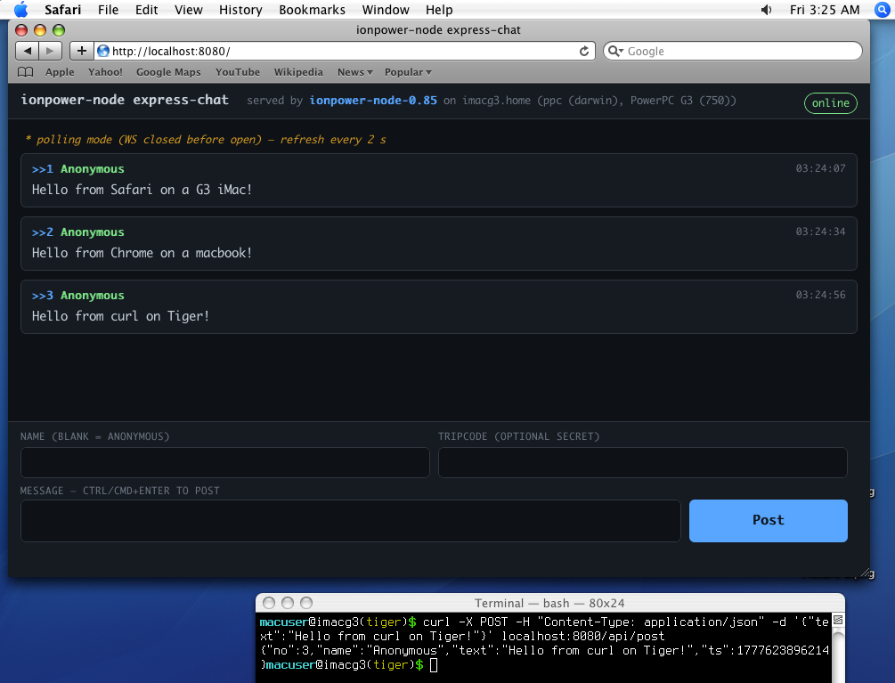

# ionpower-node


_vibe-coded with Claude_

A Node.js-compatible JavaScript runtime for 32-bit PowerPC Mac OS X
10.4 (Tiger), built on top of the JIT-enabled SpiderMonkey that ships
in [TenFourFox](https://github.com/classilla/tenfourfox). We reuse
IonPower — TenFourFox's hand-written 32-bit PowerPC backend for
SpiderMonkey's Ion and Baseline JITs — and layer a small Node-shaped
bridge on top (CommonJS `require`, `console`, `process`, a sync
`fs`, `path`, and a Buffer shim).

## Try it out!

On any G3, G4, or G5 Mac running Tiger or Leopard:

```
sudo mkdir -p /opt
sudo chmod ugo+rwx /opt
cd /opt
curl http://leopard.sh/binpkgs/gcc-libs-4.9.4.tiger.g3.tar.gz | gunzip | tar x
ln -s gcc-libs-4.9.4 gcc-4.9.4
curl http://leopard.sh/dist/ca-certificates-20230110.tar.gz | gunzip | tar x
curl http://leopard.sh/misc/beta/mozjs-45-ionpower-g3.tar.gz | gunzip | tar x
curl http://leopard.sh/misc/beta/ionpower-node-0.99-g3-ppc.tar.gz | gunzip | tar x
cd /opt/ionpower-node-0.99/bin
./node ../share/ionpower-node/demos/express-chat/server.js
```



## Status

**Beta — usable.** Releases ship triad-built tarballs for **G3
(PPC 750)**, **G4 (PPC 7450)**, and **G5 (PPC 970)** on every tag.
SpiderMonkey 45 + IonPower JIT is built once per arch and lives at
`/opt/mozjs-45-ionpower-{g3,g4,g5}/`; the runtime tarball unpacks
beside it at `/opt/ionpower-node-<version>/`.

Real event loop (select-based, wall-clock timers, fd I/O), real
async `fs` / `http` / `https` / `net` / `tls` / `dgram` /
`child_process` / `dns`, WHATWG Streams, real RSA / Ed25519 / X.509
/ AES-GCM crypto, real DEFLATE compression, real OpenSSL-backed
TLS 1.2 + 1.3 (statically linked into the runtime since v0.85),
and a TAP `node:test` runner with mocks. See the table below for
the current per-module accounting.

[Full release archive on GitHub](https://github.com/cellularmitosis/ionpower-node/releases).

See [docs/build-notes.md](docs/build-notes.md) for a running log
of what we had to discover to configure the build on Tiger.

## Why

A useful JavaScript runtime on PowerPC needs a working JIT. Writing
a new 32-bit PPC JIT is weeks to months of work. TenFourFox already
ships one — `js/src/jit/osxppc/` in their tree is a complete
Baseline + Ion backend, production-tested via real Firefox browsing
on PPC through FPR32. This project piggybacks on that investment.

We are **not** re-implementing Node.js. We implement just enough of
Node's public surface to run simple CommonJS programs end-to-end.

## Layout

```
docs/           Design docs, build notes, session summaries.
external/       Upstream source references (sparse-checked-out).
  tenfourfox/   Mozilla tree containing js/src/, js/public/, mfbt/, ...
scripts/        One-shot setup scripts shipped to fleet hosts.
  build-autoconf-213.sh     Build autoconf 2.13 into /opt on a Tiger host.
  build-mozjs.sh            Configure + build standalone SpiderMonkey for
                            the host arch (G3 / G4 / G5).
src/            C++ bridge source for the runtime.
  main.cpp                  Entry point: JS_Init, runtime, global, run.
  node_compat/              Node-shaped API surface.
    console.cpp / process.cpp / fs.cpp / path.cpp / buffer.cpp /
    require.cpp / event_loop.cpp / timers.cpp / net.cpp / http.cpp /
    crypto.cpp / child_process.cpp / zlib.cpp /
    globals.{cpp,h}         Install + wire it all onto the global.
Makefile        Target-host build rules (needs a built mozjs).
test/           400+ smoke files. Most pair with a vendored library:
  test/<thing>_smoke.js     One-file end-to-end exercise of a feature
                            or vendored package.
  test/vendor/              Vendored npm packages, used both at runtime
                            (require fallback) and as smoke targets.
```

## Install + build

The runtime needs a matching SpiderMonkey + IonPower JIT installed
beside it. Both are shipped as separate release tarballs so you only
download the SpiderMonkey once (it's a few hundred MB on disk and
rarely changes), then unpack a fresh runtime tarball per release.

**Final layout** (G3 example):

```
/opt/
├── mozjs-45-ionpower-g3/        <- SpiderMonkey + IonPower JIT (-mcpu=750)
│   ├── bin/, include/, lib/...
├── ca-certificates-20230110/    <- CA bundle (default trust store)
│   └── share/cacert.pem
└── ionpower-node-0.99/          <- Node-compat runtime (statically links OpenSSL 1.1.1t)
    └── bin/node                 <- expects sibling mozjs
```

The fastest path: grab prebuilt tarballs. The runtime is attached to
the [v0.99 release](https://github.com/cellularmitosis/ionpower-node/releases/tag/v0.99);
the matching SpiderMonkey hasn't changed since
[v0.87](https://github.com/cellularmitosis/ionpower-node/releases/tag/v0.87)
and is reused.

```bash
# One-time: SpiderMonkey + IonPower JIT (G3 example, unchanged since v0.87)
curl -L -O https://github.com/cellularmitosis/ionpower-node/releases/download/v0.87/mozjs-45-ionpower-g3.tar.gz
sudo tar xzpf mozjs-45-ionpower-g3.tar.gz -C /opt/

# One-time: CA bundle for tls / https. Either:
#   tiger.sh install ca-certificates
# or, without tiger.sh:
cd /opt && \
  curl http://leopard.sh/dist/ca-certificates-20230110.tar.gz | gunzip | tar x

# Per release: the runtime
curl -L -O https://github.com/cellularmitosis/ionpower-node/releases/latest/download/ionpower-node-0.99-g3-ppc.tar.gz
sudo tar xzpf ionpower-node-0.99-g3-ppc.tar.gz -C /opt/

/opt/ionpower-node-0.99/bin/node test/hello.js
```

For G4 use `mozjs-45-ionpower-g4` (`-mcpu=7450`); for G5,
`mozjs-45-ionpower-g5` (`-mcpu=G5 -D_PPC970_`). Native arch pairs are
fastest, but the PPC instruction set is forward-compatible — a G3
runtime + G3 mozjs runs fine on G4 / G5 hardware (just slower than a
native build). See [`BUILDING.md`](BUILDING.md) for the full
compatibility table.

**Building from source, the triad release flow, troubleshooting:**
see [`BUILDING.md`](BUILDING.md). (The build still needs OpenSSL
1.1.1t headers + libs at `/opt/openssl-1.1.1t/` to link against;
prebuilt runtimes statically embed it so end users don't need a
separate OpenSSL install.)

**Running the smoke suite, the demo round-trips, or the WPT / Node
conformance sweeps:** see [`TESTING.md`](TESTING.md).

## Demos

The [`demos/`](demos/) directory has runnable showcase pieces. Each
exercises a slice of the runtime's surface end-to-end.

| Demo | What it shows |
|---|---|
| [`demos/chat/`](demos/chat/) | Multi-client WebSocket chat. HTTP + RFC 6455 server + EventEmitter broadcast over the select() event loop, served from a 1999 iBook G3 to as many modern browsers as you point at it. The page also works in **Safari 4 on Tiger PPC** — feature-detects WebSocket and falls back to XHR short-poll over the same `/poll` + `/post` endpoints. |
| [`demos/npm-fetch/`](demos/npm-fetch/) | `npm install` from `registry.npmjs.org`, end-to-end on a G3: `fetch` over the curl shim → `zlib.gunzipSync` → POSIX ustar parse → `fs.writeFileSync` → `require()`. ~1 s for a small no-deps package like `mri`. |
| [`demos/paste/`](demos/paste/) | JWT-secured encrypted paste server. Browser POSTs text → AES-256-GCM encrypt → real DEFLATE compress → fs write → ES256 (ECDSA P-256) JWT bearer issued. GET with bearer → ECDSA verify → gunzip → AES-GCM decrypt with auth-tag check. End-to-end exercise of the v0.65–v0.81 crypto + zlib + http stack. |
| [`demos/express-chat/`](demos/express-chat/) | **Real Express 4 app** running on the runtime — anonymous chat board in 4chan / 8chan style. Optional tripcodes (`name#secret` → SHA-256 hashed), sequential post numbers, `>>N` auto-linking, in-memory ring buffer, per-IP rate limit. ~25 vendored Express deps under `test/vendor/express/node_modules/`. Also works in **Safari 4 on Tiger PPC** via the same WS-or-poll fallback. |
| [`demos/https/`](demos/https/) | **HTTPS server + client over real OpenSSL.** Self-signed cert generated at startup (`tls.generateSelfSigned`), then `https.createServer` over `tls.TLSSocket`. CLI client speaks to the local server *or* any public HTTPS URL — prints status, headers, TLS info (protocol / cipher / peer cert), body. Showcases the v0.83 `tls`/`https` surface. |
| [`demos/blog/`](demos/blog/) | Static-site generator. Reads markdown posts under `input/`, renders via Handlebars with templates `index.hbs` / `post.hbs`, writes a styled blog tree to `output/`. |
| [`demos/feed-report/`](demos/feed-report/) | Parses a sample RSS feed (XML), summarises items, prints a digest. |
| [`demos/http-fetch/`](demos/http-fetch/) | `fetch` + render JSON to a console table. |
| [`demos/json2yaml/`](demos/json2yaml/) | Tiny CLI; emits YAML for any JSON on stdin. |
| [`demos/log-scan/`](demos/log-scan/) | Scans a log file for errors with regex + colorized output. |
| [`demos/ssg/`](demos/ssg/) | A second take on the SSG idea (different template engine). |
| [`demos/url-dashboard/`](demos/url-dashboard/) | Polls a list of URLs, prints latency + status as a TTY dashboard. |

## Scope limits

We're not re-implementing all of Node. Things that are *not* on
the runtime, today:

- **mTLS / client certs** — `tls.connect` doesn't take a `cert`/`key`
  pair on the client side yet. Server-side cert auth only.
- (Asymmetric crypto is feature-complete on the curves we support:
  RSA + Ed25519 + ECDSA + ECDH all work for sign / verify / encrypt
  / decrypt / agree. RSA / ECDSA / ECDH are slow on G3 because
  bn.js bignum isn't tuned for 32-bit PowerPC. RSA-2048 keygen via
  the OpenSSL `tls.generateSelfSigned` helper is much faster than
  the bn.js path — ~3 s on G3.)
- **Brotli** — `zlib.brotliCompressSync` / `brotliDecompressSync`
  throw. `gzip` / `deflate` work for real.
- **`Intl`** — SM45 was built `--without-intl-api`. Blocks luxon,
  ICU-dependent date / number formatters.
- **Native addons** — no N-API.
- **CJS top-level-await result export** — top-level `await` works
  for entry-point scripts via an async-IIFE wrap, but CJS modules
  can't synchronously export a value that's computed via TLA. Real
  Node only supports module-level TLA in ESM, which we don't run
  natively (the Babel path lowers ESM to CJS, losing the ability to
  await at module load time).
- **Worker shared memory** — `worker_threads` is process-backed
  (each Worker is a fresh `node` child), so `transferList` /
  `MessageChannel` / `MessagePort` / `Atomics` don't apply. Use
  `BroadcastChannel` for in-process pub/sub.
- **`cluster.fork()`** — single-process degenerate; `isPrimary`
  always wins, `fork()` throws.

See [`docs/plan.md`](docs/plan.md) for the original Phase-1 scope
target, which is now well exceeded.

## Node API implementation status

A live accounting of which parts of the Node API the runtime
implements, approximates, or explicitly stubs. Updated as each
release lands.

### Core modules

| Module | Status | Notes |
|---|---|---|
| `fs` (sync) | ✅ Working | `readFileSync`, `writeFileSync`, `existsSync`, `readdirSync`, `statSync`, `lstatSync` (alias), `unlinkSync`, `mkdirSync` (+ recursive), `rmdirSync` / `rmSync` (+ recursive), `appendFileSync`, `copyFileSync`, `cpSync` (recursive), `chmodSync`, `renameSync`, `realpathSync` (passthrough). Errors carry Node-style `.code`/`.errno`/`.syscall`/`.path`. |
| `fs` (async) | ✅ Working | Callback-style `readFile`/`writeFile`/`readdir`/`stat`/`lstat`/`unlink`/`mkdir`/`rmdir`/`rm`/`rename`/`appendFile`/`copyFile`/`cp`/`chmod`/`access`/`realpath`/`exists`. Each wraps the sync version + fires the callback via the timer queue. |
| `fs.promises` / `require('fs/promises')` | ✅ Working | Promise-wrapped version of every callback form. The `fs/promises` and `node:fs/promises` subpath specifiers resolve to `fs.promises`. |
| `fs.constants` | ✅ Working | `F_OK`/`R_OK`/`W_OK`/`X_OK`/`O_RDONLY`/`O_WRONLY`/`O_RDWR`. |
| `fs.createReadStream`/`WriteStream` | ✅ Working | `createReadStream(path, {highWaterMark, encoding, start, end})` emits `'open'`/`'data'`/`'end'`/`'close'`. `createWriteStream(path, {flags})` supports `'w'` (write) / `'a'` (append); flushes on `.end()`. Whole-file-in-memory under the hood — not truly streaming to disk, but fine for realistic file sizes on Tiger-era kit. `.pipe()` works. |
| `path` | ✅ Working | `join`, `resolve`, `normalize`, `dirname`, `basename`, `extname`, `relative`, `parse`, `format`, `sep`, `delimiter`, `isAbsolute`. POSIX-only runtime, so `require('path/posix')` and `require('path/win32')` both alias to the same `path`. |
| `os` | ✅ Working | `platform` (`darwin`), `arch` (`ppc`), `type`, `release`, `version`, `machine`, `endianness` (`BE`), `homedir`, `tmpdir`, `EOL`, `devNull`, `availableParallelism`, `userInfo`, `networkInterfaces` (empty stub), `constants.signals/errno/priority`. **`hostname()`** runs `/bin/hostname`. **`cpus()`** probes `hw.cpusubtype` + `hw.cpufrequency` + `hw.ncpu` via `sysctl` and maps the Mach-O subtype (9/10/11/100) to the right PowerPC variant (G3 750 / G4 7400 / G4 7450 / G5 970). **`loadavg()`** parses `/usr/bin/uptime`. **`totalmem()`** is `hw.memsize` via sysctl. **`freemem()`** is `Pages free + Pages speculative` from `/usr/bin/vm_stat`. |
| `events` | ✅ Working | `EventEmitter` with `on`/`once`/`off`/`emit`/`addListener`/`removeListener`/`removeAllListeners`/`listenerCount`/`listeners`/`rawListeners`/`eventNames`/`prependListener`/`prependOnceListener`. Module exports `events.once(emitter, name)` (Promise), `events.getEventListeners`, `events.setMaxListeners`, `events.defaultMaxListeners`. |
| `util` | ✅ Working | `format`, `inspect` (depth-limited, cycle-safe), `inherits`, `promisify` (+ `.custom`), `callbackify`, `deprecate`, `types.*`, `isDeepStrictEqual`, `stripVTControlCharacters`, `parseArgs`, `TextEncoder`/`TextDecoder`, plus all the legacy `isX` predicates. |
| `buffer` | ✅ Working | `Buffer` class: `from` (string/array/Buffer/ArrayBuffer), `alloc`, `allocUnsafe`, `isBuffer`, `concat`, `byteLength`, `compare`, `isEncoding`. Instance: `toString`, `slice`, `write`, `copy`, `fill`, `indexOf`, `includes`, `equals`, `.length`. |
| `crypto` | ✅ Working | `randomBytes` (real entropy), `pseudoRandomBytes`, `randomUUID` (v4), `randomInt`, `createHash` (**md5/sha1/sha224/sha256/sha384/sha512**), `createHmac` across all of those, `pbkdf2Sync`/`pbkdf2` across all of those, `scryptSync`/`scrypt` (RFC 7914), `createCipheriv`/`createDecipheriv` (**AES-128/192/256 in CBC / CTR / GCM**; NIST SP 800-38A F.2.5 / F.5.5 + NIST GCM Test Case 3 vectors verified; PKCS#7 padding for CBC; setAAD/setAuthTag/getAuthTag for GCM), `hkdfSync`/`hkdf` (RFC 5869 across all hashes; TC1 verified), `timingSafeEqual`, `createSecretKey`, `createPrivateKey`, `createPublicKey` (raw/JWK Ed25519 + PEM RSA), `generateKeyPair{,Sync}` (Ed25519 native, **RSA** via node-forge), `sign`/`verify` (Ed25519 native + RSA via forge across sha256/sha384/sha512), `publicEncrypt`/`privateDecrypt` (RSA-OAEP across sha1/sha256), **ECDSA** via vendored elliptic on `P-256`/`P-384`/`P-521`/`secp256k1` (slow on G3 — ~3 s sign, ~13 s verify for P-256), `crypto.diffieHellman({ privateKey, publicKey })` for **NIST ECDH** on the same curves (returns left-padded X-coordinate Buffer), `X509Certificate` (PEM/DER ctor; `subject`/`issuer`/`validFrom`/`validTo`/`serialNumber`/`fingerprint{,256,512}`/`raw`/`subjectAltName`/`publicKey`/`ca`; `toString`/`toJSON` -> PEM; `checkIssued`/`checkPrivateKey`/`checkHost`/`verify`), `getHashes`, `getCiphers`. |
| `http` | ✅ Working | Real async `http.request`/`http.get`/`http.createServer` on top of `net.Socket` + an in-house HTTP/1.1 parser. Content-Length and chunked Transfer-Encoding on both sides. Server supports auto-chunked responses (stream `.write()` without Content-Length) and keep-alive pipelining. `IncomingMessage` / `ServerResponse` / `ClientRequest` classes present. Sync `http.getSync`/`postSync` retained (curl-backed, handles HTTPS). |
| `https` | ✅ Working | Real async `https.request`/`https.get`/`https.createServer` over `tls.TLSSocket` + the same HTTP/1.1 parser as `http`. Sync curl wrappers (`getSync`/`postSync`) retained for the simple sync path. |
| `tls` | ✅ Working | `tls.connect(opts)`, `tls.createServer({ cert, key })`, `tls.TLSSocket` extending `net.Socket` (emits `'secureConnect'` after handshake; same `'data'`/`'end'`/`'close'`/`'error'` event surface). Linked against OpenSSL 1.1.1t (`/opt/openssl-1.1.1t/`). TLS 1.2 + 1.3, SNI, peer cert verify against the bundled `/opt/ca-certificates-20230110/share/cacert.pem`. `socket.getPeerCertificate()` / `getCipher()` / `getProtocol()` introspection. `tls.generateSelfSigned(cn, days)` helper for demos. |
| `dns` | ✅ Working | `lookup` / `resolve` / `resolve4` / `resolve6` / `promises.lookup` via `gethostbyname` (blocking under the hood; called from event-loop `setImmediate`). MX/TXT/CNAME/SRV/NS `resolve*` return empty arrays for compatibility. |
| `net` | ✅ Working | `net.Socket` (Duplex over event-loop `ioWatch`) + `net.createServer` / `createConnection`. BSD-socket primitives via `__net_native__`: `socketCreate`/`bind`/`listen`/`accept`/`connect` non-blocking. IPv4 only; `gethostbyname` for DNS. |
| `dgram` (UDP) | ✅ Working | `dgram.createSocket('udp4')` / `Socket#bind` / `send` / `close`. `'message'` / `'listening'` / `'error'` / `'close'` events. Receives via `ioWatch(fd, READABLE)` + `recvfrom`; sends via `sendto`. IPv4 only; auto-binds to an ephemeral port if `.send()` is called before `.bind()`. |
| `readline` | ✅ Working | `createInterface({ input, output })`, `'line'` / `'close'` events, `.question(prompt, cb)` (one-shot), `.pause`/`.resume`/`.close`, `.setPrompt`/`.prompt`. Cursor helpers (`cursorTo`, `moveCursor`, `clearLine`, `clearScreenDown`) emit ANSI CSI when the target stream is a TTY, no-op otherwise. |
| `node:test` / `test` | ✅ Working | TAP runner. `test(name, fn)`, `test.skip`/`test.todo`, `test.describe`/`test.it`, `test.before`/`after`/`beforeEach`/`afterEach` lifecycle hooks. Async test functions, nested `t.test(sub, fn)`, `t.diagnostic(msg)`. **Mock support**: `t.mock.fn(impl?)` (tracks `.calls`/`.callCount()`/`.resetCalls()`/`.mockImplementation()`), `t.mock.method(obj, name, impl?)`, `t.mock.getter`/`setter`, with auto-restore at test end. Registers on import, runs on next tick, prints TAP 13 + plan + ok/not-ok + fail counts. Sets `process.exitCode = 1` on any failure. |
| `ws` / `WebSocket` | ✅ Working | RFC 6455 client (`new WebSocket(url, protocols, opts)` — browser-style `.onopen`/`.onmessage`/`.onclose`/`.onerror`) + server (`require('ws').WebSocketServer({ port, host, cert?, key? })`). Text + binary frames, ping/pong autorespond, close-frame handshake. Server and client share frame encode/decode; client frames are masked per spec. **`wss://`** works — pass `{ cert, key }` to the server, `wss://` URL to the client; under the hood swaps `net.Socket` for `tls.TLSSocket`. |
| `child_process` | ✅ Working | All sync + async variants except `fork`. `execSync`/`spawnSync`/`execFileSync` via blocking fork+waitpid. `spawn`/`exec`/`execFile` return a `ChildProcess` (EventEmitter) backed by the event loop — `.stdout`/`.stderr` are Readables, `.stdin` is Writable, emits `'exit'`(code,sig) then `'close'`. |
| `stream` | ✅ Working | Real `Readable` / `Writable` / `Duplex` / `Transform` / `PassThrough` with buffering, `.pipe()`, `.read([n])` / `.push(chunk)` / `.end()`. `stream.pipeline()` / `stream.finished()` (callback + Promise forms). Subpath specifiers: `require('stream/web')` -> `{ ReadableStream, WritableStream, TransformStream, ByteLengthQueuingStrategy, CountQueuingStrategy }`; `require('stream/promises')` -> `{ pipeline, finished }`; `require('stream/consumers')` -> `{ buffer, arrayBuffer, text, json, blob }` (drains a WHATWG or Node readable into the named type). Backpressure is nominally modeled but collapses to always-drained under the sync runtime; pipe auto-resumes whenever a `'data'` listener is added. |
| `string_decoder` | ✅ Working | `StringDecoder` over Buffer-to-UTF-8 with partial-multibyte buffering across `.write()` calls. |
| `querystring` | ✅ Working | `parse`/`stringify` with custom sep/eq, array-valued keys, `escape`/`unescape`/`encode`/`decode`. |
| `url` | ✅ Working | Legacy `parse` (full URL object shape), `format`, `resolve`, `fileURLToPath`, `pathToFileURL`, plus WHATWG `URL`/`URLSearchParams` globals. |
| `assert` | ✅ Working | `equal`, `strictEqual`, `notEqual`, `notStrictEqual`, `deepEqual`, `deepStrictEqual`, `throws`, `doesNotThrow`, `fail`, `ok`, `AssertionError`. |
| `timers` | ✅ Working | `setImmediate`/`setTimeout`/`setInterval` + matching clears enqueue into the event loop. `select()`-based loop blocks until the next `fireAt` (real wallclock), wakes on fd events or `SIGCHLD`, then fires due timers. `setTimeout(fn, 100)` really does wait ~100ms. Intervals re-queue themselves. |
| `tty` | ✅ Working | `tty.ReadStream`/`WriteStream` constructors, `tty.isatty(fd)`. `process.stdin.setRawMode(bool)` is real — `tcsetattr`-backed via the `process._setRawMode` native; saves the original termios on first call so `setRawMode(false)` restores exactly what the user had. `process.stdout.columns`/`rows` come from `ioctl(TIOCGWINSZ)` at startup; falls back to 80×24 if the fd isn't a sized TTY. CLI prompt libraries (inquirer, prompts) work as a result. |
| `module` | ✅ Working | `createRequire(filename)`, `builtinModules`, `isBuiltin(name)`, `Module` class with `_cache` (mirrors `__require_cache__`), `_extensions`, `wrap(src)`, `wrapper`, plus static `Module.{builtinModules,isBuiltin,createRequire}`. |
| `async_hooks` | ✅ Working | `AsyncLocalStorage` (run/getStore/exit/disable/enterWith). State snapshot is captured at every microtask + timer enqueue (Promise.then chains, setTimeout, setImmediate, queueMicrotask) and restored before the callback fires, so `als.run(store, () => Promise.resolve().then(...))` propagates correctly. Doesn't yet propagate through I/O event-loop `ioWatch` callbacks. `executionAsyncId`/`createHook` callable but no-op. |
| `diagnostics_channel` | ✅ Working | `channel(name)`, `subscribe`/`unsubscribe`, `hasSubscribers`, `publish(data)`. Channel instances cached by name. Module-level `dc.subscribe(name, fn)` / `dc.unsubscribe`. `tracingChannel(name)` returns `{ start, end, asyncStart, asyncEnd, error }` sub-channels with `.traceSync(fn, ctx)` / `.tracePromise(fn, ctx)` / `.traceCallback(fn, position, ctx, ...args)` helpers. |
| `worker_threads` | ✅ Working (process-backed) | Real `Worker` spawning a fresh `node` child process; parent ↔ child speak length-prefixed JSON frames over stdin/stdout. `parentPort.on('message')` / `postMessage` round-trips. `isMainThread`, `workerData`, `Worker#terminate()`. No shared memory / `transferList` / `MessageChannel` / `MessagePort` / Atomics — use `BroadcastChannel` for in-process pub/sub instead. Slow startup (~1 s on G3) since each Worker is a process. |
| `cluster` | 🟡 Stub | Single-process degenerate: `cluster.isMaster=true`, `cluster.isPrimary=true`, `cluster.workers={}`, `cluster.schedulingPolicy`. `cluster.fork()` throws. Enough for libraries that branch on `if (cluster.isMaster)` to take the master path. |
| `zlib` | ✅ Working | Real RFC 1951 inflate via embedded tiny-inflate. **Real DEFLATE compression** by shelling out to `/usr/bin/gzip` (always present on Tiger), then stripping or rewrapping the framing for `deflateSync`/`deflateRawSync`. Falls back to stored-mode framing if `gzip` is missing — so output is always a valid deflate stream. `gzipSync`/`gunzipSync`/`deflateSync`/`inflateSync`/`deflateRawSync`/`inflateRawSync` + all matching async/Transform variants. Adler-32 (zlib) + CRC-32 (gzip) computed correctly. Brotli still throws. |

### Globals

| Global | Status | Notes |
|---|---|---|
| `process` | ✅ Working | `argv`, `env`, `cwd`, `exit`, `exitCode`, `platform`, `arch`, `version`, `versions` (`node`/`ionpower`/`spidermonkey`/`v8`), `release`, `pid`, `stdout`/`stderr`/`stdin` (all with `.fd`/`.isTTY`; `stdin` is a real Readable streaming via `ioWatch(0, READABLE)` + non-blocking reads, emits `'data'` chunks + `'end'` on EOF), `nextTick` (microtask-queued), `umask`, `hrtime` (+ `.bigint`), `uptime`, `title`, `memoryUsage` (zero-filled), event-emitter surface (`on`/`once`/`off`/`emit` including `'exit'` flush). |
| `fetch` / `AbortController` / `AbortSignal` | ✅ Working | WHATWG-minimal `fetch(url, init)` → `Response` with `.text()`/`.json()`/`.arrayBuffer()`/`.buffer()`. `Headers` Map-ish API. `AbortController.abort(reason)` propagates to an in-flight fetch. `AbortSignal.timeout(ms)` and `.abort(reason)` static factories. Both `http://` and `https://` URLs go through the real async `http`/`https` modules. |
| `Buffer` | ✅ Working | See `buffer` above. |
| `console` | ✅ Working | `log`/`error`/`warn`/`info`/`debug`/`trace`/`dir`/`time`/`timeEnd`/`assert`. |
| `Promise` | ✅ Polyfill | `.then`/`.catch`/`.finally` callbacks are routed through the event loop's microtask queue; fire after the current synchronous code returns, before setTimeout-queued work. `Promise.resolve`/`reject`/`all`/`race`/`allSettled`. |
| `queueMicrotask` | ✅ Microtask-queued | Pushes onto `__microtask_queue__`; the event loop drains between callback firings. |
| `setTimeout`/`setInterval`/`setImmediate` | ✅ Wallclock-real | Enqueue into the event loop; `select()` honors the next fireAt. `setTimeout(fn, N)` sleeps ~N ms before firing. Intervals self-requeue. |
| `TextEncoder`/`TextDecoder` | ✅ Working | UTF-8 only. |
| `URL`/`URLSearchParams` | ✅ Polyfill | Covers protocol/host/hostname/port/pathname/search/hash/origin/href + username/password, plus search-params get/getAll/has/set/append/delete/forEach/keys/values/entries/toString/sort. Not spec-complete for IDN / non-special schemes / exotic relative resolution. |
| `crypto` (WebCrypto) | ✅ Working | `crypto.getRandomValues`, `crypto.randomUUID`, `crypto.subtle` with `digest`/`sign`/`verify`/`encrypt`/`decrypt`/`deriveBits`/`importKey`/`exportKey`/`generateKey`/`wrapKey`/`unwrapKey` over SHA-{1,256,384,512}, HMAC, AES-{CBC,CTR,GCM,KW}, PBKDF2, HKDF, **Ed25519** (sign/verify/generateKey/import/export), **X25519** (generateKey/deriveBits — curve25519 ECDH), **ECDSA** on `P-256`/`P-384`/`secp256k1` (sign/verify with hash sha1/256/384/512; raw r‖s sigs), **NIST ECDH** on the same curves (deriveBits). EC JWK import/export with full `{kty:'EC', crv, x, y, d?}` shape; raw uncompressed-point (`0x04 ‖ X ‖ Y`) export for public keys. |
| `ReadableStream`/`WritableStream`/`TransformStream` | ✅ Polyfill | WHATWG Streams minimal shape. `ReadableStream` supports `start`/`pull`/`cancel` sources, `getReader().read()`, `locked`, `tee()`, `pipeTo`, `pipeThrough`. `WritableStream` supports `start`/`write`/`close`/`abort` sinks, `getWriter().write`/`close`/`abort`/`releaseLock`. `TransformStream` bundles the pair with `start`/`transform`/`flush`. Backpressure is best-effort (no explicit high-water-mark queue). |
| `atob`/`btoa` | ✅ Working | |
| `EventTarget` / `Event` / `CustomEvent` | ✅ Working | DOM-style event API. `new EventTarget()`, `addEventListener`/`removeEventListener` (with `once`/`capture`/`signal` options; AbortSignal aborts the listener), `dispatchEvent`. `Event(type, init)` and `CustomEvent(type, { detail })` constructors with `target`/`currentTarget`/`type`/`defaultPrevented`/`preventDefault`/`stopPropagation`/`stopImmediatePropagation`. |
| `BroadcastChannel` | ✅ Working | In-process pub/sub. `new BroadcastChannel(name)`; `.postMessage(any)` -> all other channels with the same name receive a `'message'` event with `{ data }`. `.close()`, `.onmessage`, EventTarget shape. Cross-`Worker` (= cross-process) pub/sub does **not** work — only between channels in the same JS heap. |
| `performance` (WHATWG) / `perf_hooks` core | ✅ Polyfill | `performance.now()` returns ms since `performance.timeOrigin` (Date.now() at process start). `mark`/`measure`/`clearMarks`/`clearMeasures`/`getEntries*` are callable stubs. `PerformanceObserver` constructs with no-op `observe`/`disconnect`/`takeRecords`. `require('perf_hooks')` returns `{ performance, PerformanceObserver, constants }`. Resolution is ms (no sub-millisecond precision). |
| `Error.captureStackTrace` | ✅ Shim | Attaches `.stack` as an own property so error-ex / json-parse-even-better-errors work. |
| `globalThis` / `global` / `window` / `self` | ✅ All aliased | Any of the four resolves to the global object. |
| `Intl` | ❌ Missing | SM45 was built `--without-intl-api`. Blocks luxon, ICU-dependent date/number formatters. |
| `Symbol`, `Map`, `Set`, `WeakMap`, `WeakSet`, `Proxy`, `Reflect`, typed arrays | ✅ Native | SpiderMonkey 45 provides these. |
| ES2022+ small APIs | ✅ Polyfill | `Object.hasOwn`, `structuredClone` (deep clone — handles objects/arrays/Date/RegExp/Map/Set/Buffer), `AggregateError`, `Promise.any`, `Array.prototype.at`/`findLast`/`findLastIndex`/`toSorted`/`toReversed`/`toSpliced`/`with`, `String.prototype.at`/`replaceAll`. |

### CommonJS

| Surface | Status | Notes |
|---|---|---|
| `require('./rel/path.js')` | ✅ Working | |
| `require('./rel/path')` | ✅ Working | Tries `.js`, `.cjs`, then `<dir>/package.json` main. |
| `require('./rel/data.json')` | ✅ Working | Parsed and returned. |
| `require('bare-module')` node_modules walk | ✅ Working | Standard upward search. |
| `require('bare-module')` vendor fallback | ✅ Working | If node_modules lookup fails, walks caller's dir up looking for `<ancestor>/<name>.js` or `<ancestor>/vendor/<name>.js`, plus global dirs (`cwd/test/vendor`, installed `share/ionpower-node/vendor`). Lets unpatched libraries' bare `require('chalk')` etc. resolve to vendored copies. |
| `require('node:fs')` prefix | ✅ Stripped | `node:` prefix stripped before lookup. |
| Seeded core modules | ✅ Working | `__require_cache__` pre-populated with the full Node core surface: fs / fs/promises / path / path/posix / path/win32 / events / util / child_process / cluster / os / crypto / buffer / string_decoder / assert / stream / stream/web / stream/promises / stream/consumers / timers / timers/promises / querystring / dns / dns/promises / http / https / net / dgram / readline / url / zlib / worker_threads / async_hooks / diagnostics_channel / module / supports-color / has-ansi / process / vm / perf_hooks / readable-stream / inherits / node:test / test. The `node:` prefix is stripped before lookup, so `require('node:fs')` and `require('fs')` resolve to the same module. |
| ESM `import`/`export` | 🟡 Via Babel | Bootstrap lazily loads `@babel/standalone` on parse failure and re-evaluates the ESM-lowered source. Handles `import X from "y"`, `export default`, `export { X }`. Does **not** handle top-level `await`, dynamic `import()`, or `import.meta`. Cached on disk at `~/.ionpower-cache/babel-v1/`. |
| `async`/`await` / `for await` | ✅ Via Babel | `async function` / `await expr` / `try { await reject } catch` / `for await (chunk of asyncIter)` all work — same path as ESM (Babel lowers on parse failure). `Symbol.asyncIterator` is polyfilled; WebStreams `Readable` and `events.on()` iterators carry the well-known so `for await` recognizes them. |
| `import.meta` | ✅ Via regex rewrite | The Babel-on-parse-failure preprocessor rewrites `import.meta.url` -> `("file://" + __filename)`, `import.meta.filename` -> `__filename`, `import.meta.dirname` -> `__dirname`, and bare `import.meta` -> an object literal with all three. |
| Top-level `await` | ✅ Via Babel (entry-script only) | When the parser rejects `await` at top level, the bootstrap retries the source wrapped in an `async` IIFE. Works for entry-point scripts that don't need to export anything. CJS modules can't synchronously export a value computed via top-level await — that's a hard limit of CJS. |
| Dynamic `import()` | ✅ Via rewrite | `import(spec)` is regex-rewritten to `__dynamic_import__(spec, require)` which returns `Promise.resolve({ default: require(spec) })`. The local `require` is passed in so relative specifiers resolve against the importing module's directory. Works for built-in modules, relative paths, and bare module names. Specifiers with nested parens / commas at the top level aren't supported by the regex. |

### Compat shims seeded as fake packages

| Package | Provided | Why |
|---|---|---|
| `supports-color` | Built-in | Chalk family loads at runtime and reflects our `process.stdout.isTTY` + `TERM`. |
| `has-ansi` | Built-in | Predicate for strings containing SGR sequences. |
| `safe-buffer` | Built-in | Re-exports our Buffer (the real lib polyfills older Node). |
| `cli-boxes` | Vendored JSON + shim | Data-only; the `.js` wrapper reads `cli-boxes.json`. |

### Library count

Running total of third-party libraries with a passing smoke test:
**660+** as of [v0.85](https://github.com/cellularmitosis/ionpower-node/releases/tag/v0.85).
Full suite: **1990+** assertions across 432 smoke files.

The full roster is the `test/*_smoke.js` + `test/vendor/*.js` trees;
see each smoke for exactly which surface the library exercises.
